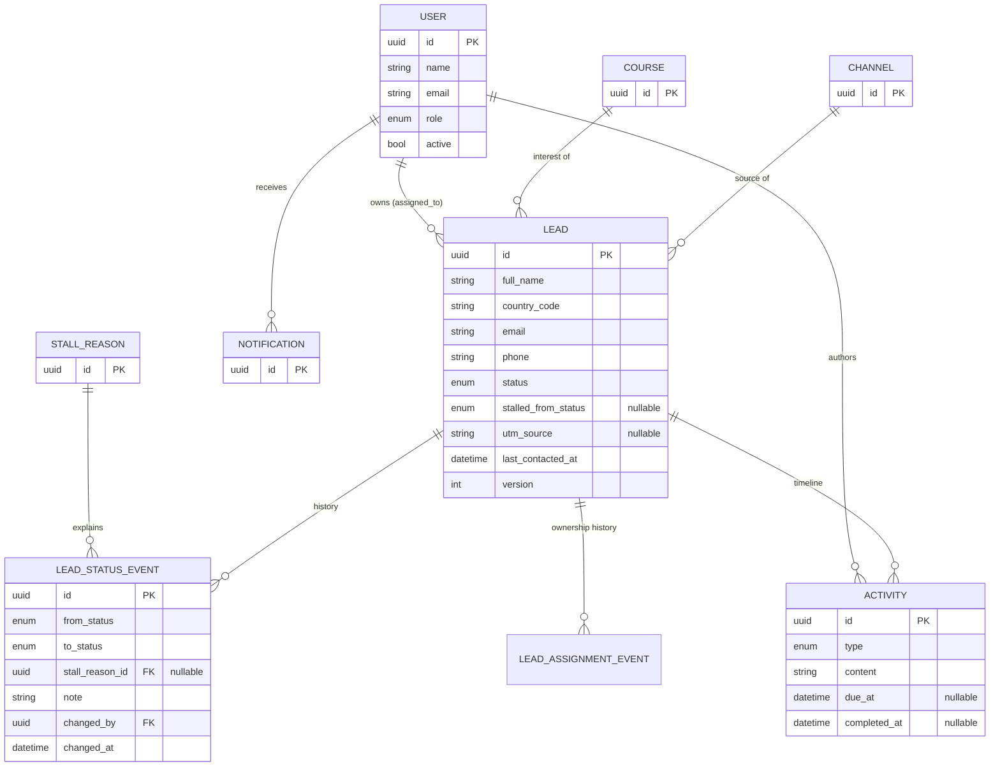

# Modelagem de Entidades — ControlLeads

> Etapa 1 (Conceitual) preenchida a partir dos `module_*.md`. Etapa 2 (Técnica: tipos SQL, índices, DDL) será feita na primeira SPEC de backend, após validação desta etapa.

---

## Etapa 1 — Modelagem Conceitual

### 1. Decisões Transversais

#### 1.1. Estratégia de identificadores
**Decisão**: `UUID` gerado pela aplicação.
**Justificativa**: dois clientes (web/app) criando registros; ID conhecido antes de persistir simplifica otimismo de UI e futura criação offline no app. Single-tenant não exige, mas o custo é zero.

#### 1.2. Tenancy
**Decisão**: **Single-tenant** — uma instituição (decisão do brief). Sem `tenant_id`, sem RLS.

#### 1.3. Auditoria
**Decisão**: **Quem + quando** (`created_by`, `created_at`, `updated_at`) em todas as entidades de negócio; mudanças críticas (status, dono) têm **log próprio em tabela** (`LeadStatusEvent`, `LeadAssignmentEvent`).
**Justificativa**: "quem trouxe/converteu o lead" é requisito de produto; o log de status é a própria fonte dos relatórios.

#### 1.4. Soft delete
**Decisão**: **Case-a-case** — `User` e itens de catálogo **desativam** (`active`), nunca somem (referências históricas). `Lead` tem soft delete (`deleted_at`) restrito ao Admin. `Activity` e eventos: sem delete (imutáveis; atividade editável só em janela curta).
**Critério**: qualquer coisa referenciada por histórico não pode sumir fisicamente.

#### 1.5. Versionamento
**Decisão**: sem versionamento de entidades; o que precisa de história (status, dono) já vira **evento imutável**. Coluna `version` (optimistic locking) apenas em `Lead` (edição simultânea web/app).

#### 1.6. Enums e catálogos
**Decisão**: **Combinação.**
- **Enums no código**: `LeadStatus`, `UserRole`, `ActivityType`, `NotificationType` (workflow fixo — mudar exige deploy mesmo).
- **Catálogos gerenciáveis**: `Course`, `Channel`, `StallReason` (Admin edita em runtime — module_settings.md).
- **País**: código ISO 3166-1 alpha-2 no lead (lista fixa no código/lib, não catálogo).

---

### 2. Domínio: Identity
> Origem: module_auth.md

##### 2.1. User `AR`
Usuário interno (equipe).
- **Atributos**: `id`, `name`, `email` (único), `password_hash`, `role`, `active`
- **Relacionamentos**: **1:N** com `Lead` (como dono), `Activity`, `Notification`
- **Observações**: nunca deletado — apenas `active=false` (RN de reatribuição em module_auth.md#rn-02).

##### 2.2. UserRole (enum)
`ADMINISTRATOR`, `MARKETING_TEAM`.

---

### 3. Domínio: Leads
> Origem: module_leads.md (+ module_settings.md para catálogos)

##### 3.1. Lead `AR`
O prospect — raiz do agregado central.
- **Atributos**: `id`, `full_name`, `country_code` (ISO), `email`, `phone`, `status`, `stalled_from_status` (nullable — etapa em que parou), `utm_source`, `utm_medium`, `utm_campaign` (nullable), `last_contacted_at` (derivado), `version`
- **Relacionamentos**:
  - **N:1** com `Course` (curso de interesse), `Channel` (origem), `User` (`assigned_to`), `StallReason` (nullable — motivo se STALLED)
  - **1:N** com `LeadStatusEvent`, `LeadAssignmentEvent`, `Activity`
- **Observações**: soft delete só por Admin; duplicidade (e-mail/telefone) **avisa, não bloqueia** (module_leads.md#rn-04).

##### 3.2. LeadStatusEvent
Transição de status — **imutável**; fonte de todos os relatórios de funil.
- **Atributos**: `id`, `from_status` (nullable no 1º), `to_status`, `stall_reason` (ref, se STALLED), `note`, `changed_by`, `changed_at`
- **Relacionamentos**: **N:1** com `Lead`, `User`
- **Observações**: sem update/delete; auditoria própria dispensa `updated_at`.

##### 3.3. LeadAssignmentEvent
Troca de dono — imutável (crédito de conversão e auditoria).
- **Atributos**: `id`, `from_user` (nullable), `to_user`, `changed_by`, `changed_at`
- **Relacionamentos**: **N:1** com `Lead`, `User`

##### 3.4. LeadStatus (enum)
`LEAD`, `HOT_LEAD`, `APPLICATION`, `STUDENT`, `STALLED`.
Transições válidas em module_leads.md#rn-01.

#### Catálogos (gerenciáveis — module_settings.md)

##### 3.5. Course
`id`, `name`, `active`.

##### 3.6. Channel
`id`, `name`, `active`. (Instagram, Google Ads, Fair, Referral, Website… — seed a definir.)

##### 3.7. StallReason
`id`, `name`, `active`. (Price, Visa denied, Chose another school, No response…)

---

### 4. Domínio: Engagement
> Origem: module_activities.md, module_notifications.md

##### 4.1. Activity
Nota/contato/follow-up no lead.
- **Atributos**: `id`, `type`, `content`, `due_at` (nullable — só FOLLOW_UP), `completed_at` (nullable)
- **Relacionamentos**: **N:1** com `Lead`, `User` (autor)
- **Observações**: editável pelo autor em janela curta (ponto em aberto), depois imutável; tipos de contato atualizam `Lead.last_contacted_at`.

##### 4.2. ActivityType (enum)
`NOTE`, `CALL`, `EMAIL`, `WHATSAPP`, `MEETING`, `FOLLOW_UP`.
Contam como "contato" (zeram SLA): `CALL`, `EMAIL`, `WHATSAPP`, `MEETING`.

##### 4.3. Notification
Alerta por usuário.
- **Atributos**: `id`, `type`, `payload` (lead ref + dados p/ render), `read_at` (nullable)
- **Relacionamentos**: **N:1** com `User` (destinatário); referência a `Lead`
- **Observações**: anti-spam por (`lead`, `type`, ciclo) — module_notifications.md#rnf-01.

##### 4.4. NotificationType (enum)
`SLA_BREACH`, `FOLLOW_UP_DUE`.

##### 4.5. AppSetting
Parâmetros do sistema (chave-valor tipado). MVP: `hot_lead_max_hours`.

---

### 5. Visão Consolidada de Relacionamentos

### 6. Decisões de Modelagem (Resolvidas)

| # | Tópico | Decisão |
|---|--------|---------|
| 1 | Fonte dos relatórios de funil | `LeadStatusEvent` imutável, nunca o status atual |
| 2 | STALLED | Estado único + `stalled_from_status` + `StallReason` (catálogo) |
| 3 | Crédito de conversão | Dono no momento da transição → STUDENT (evento guarda `changed_by`; dono via `LeadAssignmentEvent`) |
| 4 | Motivos de parada | Catálogo gerenciável + `note` livre opcional (resolve o ponto em aberto de module_leads.md) |
| 5 | `last_contacted_at` | Coluna denormalizada no Lead, atualizada por atividade de contato (SLA barato de consultar) |

### 7. Pontos a Validar

- [ ] Janela de edição de `Activity` (15 min? 24h?)
- [ ] Seed inicial de `Channel` e `StallReason`
- [ ] E-mail digest vs imediato (module_notifications.md)

---

## Etapa 2 — Modelagem Técnica

> ⏳ **Pendente** — será preenchida na primeira SPEC de backend (tipos SQL, constraints, índices, DDL), após validação da Etapa 1. Sem RLS (single-tenant).
